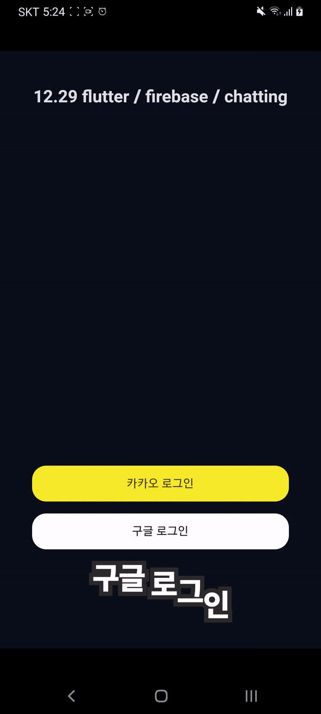
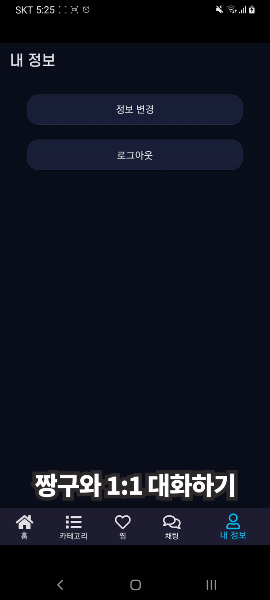
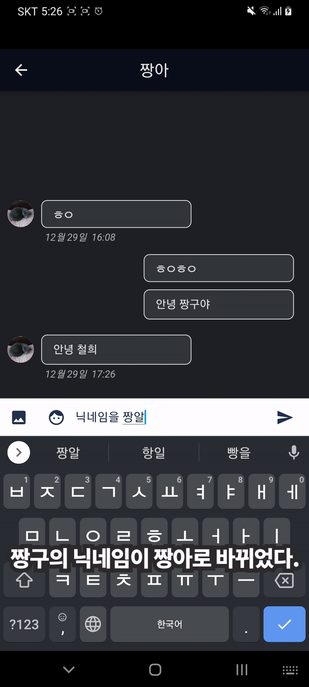
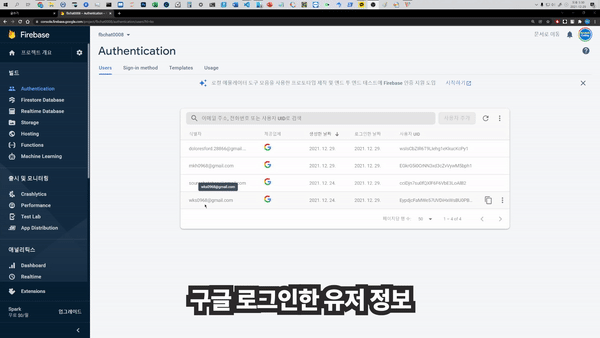
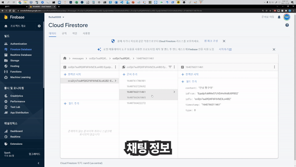
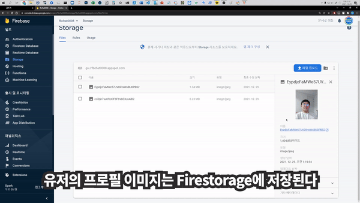

## Hola, I'm [CheolheeLee0](https://pawan.live) 👋

 
 

- 🔭 I'm currently a computer science student at [Chungnam National University](https://computer.cnu.ac.kr/).
- 🌱 I’m currently learning more about Flutter Application Development.
- 👯 I’m looking to collaborate on [Youtube](https://www.youtube.com/channel/UCREHSgfUejCm_yiWfWSen1Q).
- 💬 Ask me about Flutter or any tech-related stuff.
- 📫 How to reach me: [Tistory - @차리](https://cheolheelee.tistory.com) , [Youtube - @Dynamic Coding](https://www.youtube.com/channel/UCREHSgfUejCm_yiWfWSen1Q)
- 😄 Pronouns: He/His
- ⚡ Fun fact: I spend almost 12 hours listening to songs every day.

**Languages and Tools:**  

<code></code>
<code></code>
<code></code>
<code></code>
<code></code>
<code></code>    

    

### Show some ❤️ by starring some of the repositories!

