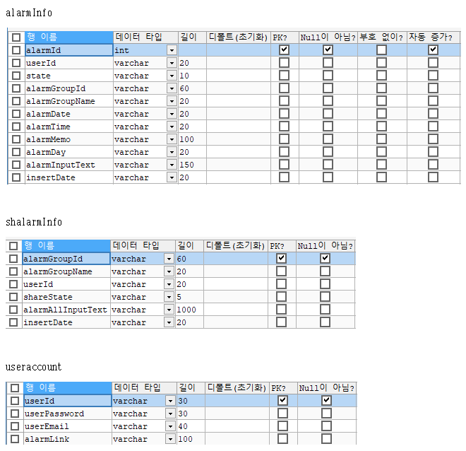

## Hola, I'm [CheolheeLee0](https://pawan.live) 👋

 
 

- ✈ I worked at [Information system management group](https://namu.wiki/w/%EA%B3%B5%EA%B5%B0%EC%A0%95%EB%B3%B4%EC%B2%B4%EA%B3%84%EA%B4%80%EB%A6%AC%EB%8B%A8) for 2 years.
- 🏬 I'm currently a computer science student at [Chungnam National University](https://computer.cnu.ac.kr/).
- 🌏 I’m currently learning more about Flutter Application Development.
- 💬 Ask me about Flutter or any tech-related stuff.
- 📫 How to reach me: [Tistory - @차리](https://cheolheelee.tistory.com) , [Youtube - @Dynamic Coding](https://www.youtube.com/channel/UCREHSgfUejCm_yiWfWSen1Q) , [Gmail - @wks0968@gmail.com](https://mail.google.com)
- 😄 Pronouns: He/His
- 💧 Fun fact: I drink at least 2 liters of water a day.

## Languages and Tools

<code></code>
<code></code>
<code></code>
<code></code>
<code></code>
<code></code>    

 
 

<!-- 
 -->

## BOJ solved.ac

## Flutter-Firebase-Chatting
### Overview
- An application that allows firebase google login users to chat.
- It is linked to the server.
- It reflects the comments in real time using stream builder.

### Technology stack
- Flutter, Dart
- Firebase
- Firebase auth
- Firestore
- Firestorage
- Streambuilder
- Provider

### Screenshots
#### In App
    
#### Backend

## Lotto number generation app
### Overview
- It is an application that collects the tools you need to enjoy the lottery.
- Lottery number winning information.
  - You can check the winning information of the previous week.
  - You can check the number of winners and the amount of winners.

- Lotto number generation.
  - Lotto numbers that include or exclude a set number can be randomly generated and stored.

- Lotto number storage.
  - We help you manage your own lottery number by checking or deleting the created lottery number.

- Check out nearby lotto stores.
  - I'll help you find a lottery store near my location.

- QR code shooting.
  - Search for winning information using QR codes.

### Technology stack
- Flutter
- Firebase
- SQLite
- Google maps
- QR code scanner
- GetX

### Screenshots
    

## Share Alarm web application
### Overview
- Shalarm is a text-based alarm sharing service. 
- You can easily add alarms for the day of the week by using keywords on weekdays, weekends, and every day. 
- Alarm information stored on the server can be accessed and retrieved anytime, anywhere with login information. 
- Group alarms to which multiple alarms belong and divided by group name can be shared with multiple people once registered, increasing the reuse of alarms. 
- You can conveniently add a specific group alarm to your schedule with a click. 
- Other functions include timer and stopwatch functions.

### Technology stack
- web link : [https://shalarm.herokuapp.com/](https://shalarm.herokuapp.com/)
- Frontend : React.js
- Backend : Node.js
- Database : MySQL
- Server : heroku

### Screenshots
 
 
 

### Show some ❤️ by starring some of the repositories!

