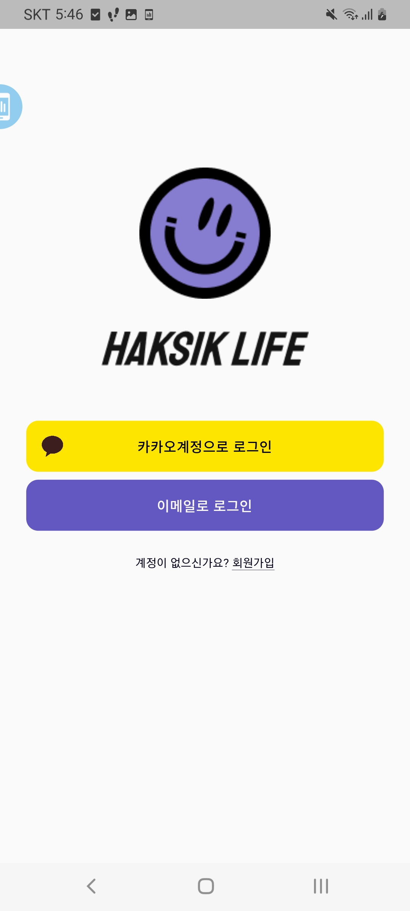
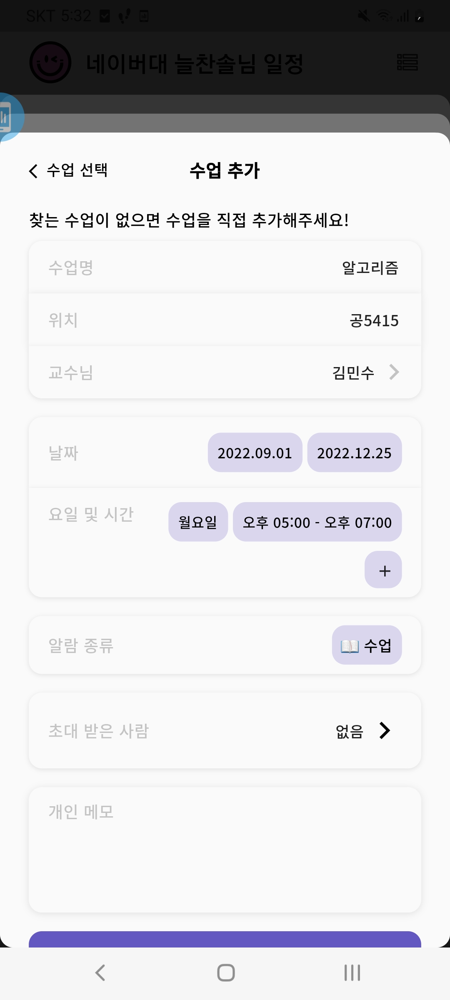
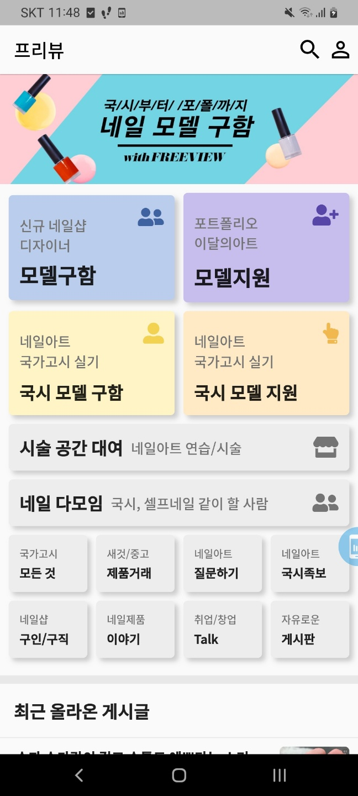
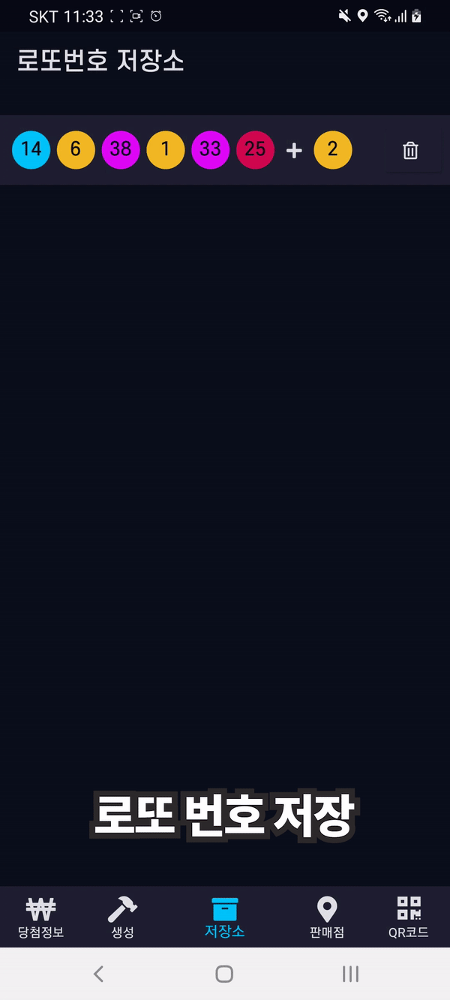

## Hi, I'm [CheolheeLee0](https://pawan.live) 👋

### Studying At
- [Chungnam National University CSE](https://computer.cnu.ac.kr/)

### Work experience

- [Information system management group](https://namu.wiki/w/%EA%B3%B5%EA%B5%B0%EC%A0%95%EB%B3%B4%EC%B2%B4%EA%B3%84%EA%B4%80%EB%A6%AC%EB%8B%A8) : 2019.10~2021.05
  - Software Maintenance and Development 
  - Air force overtime management system

### App Projects

- Collaborative Development
  - student calendar app
  - nail art community app
  
- Outsourcing Development
  - chinese education app
  - phisycal estimation app

- Personal Project
  - Lotto number generation app
  - Share Alarm Web app

### Hobby
- coding, youtube, playing with cat, cycling, walking, visiting good restaurants, watching movie

### How to Reach me

## Languages and Tools

### Frontend

 

### Backend

 

 

### CI/CD

### Cloud

 

 

### Design

 
 

 
 

## BOJ solved.ac

## PAPS(Physical Activity Promotion System) - In Progress

### Overview
- As a student health fitness evaluation system, it is a health fitness management program developed to prevent obesity and physical decline of students by completely revising the physical fitness system that evaluates exercise-related physical strength in elementary and secondary schools.

### Technology stack
- Frontend : Flutter, GetX
- Backend : Node.js, TypeScript
- Database : Amazon RDS, PostgreSQL
- Design : Figma
- Platform : Android, iOS

### Screenshots

 

## 보이는중국어(Visible Chinese) Flutter application

### Overview
- Chinese conversation education application that learns by looking at native pronunciation.
- You can re-learn words that you don't know or are confused by the function of reviewing them.

### Technology stack
- Frontend : Flutter, GetX
- Backend : Firebase
- Database : Firestore
- Design : Adobe
- Ad : Google Admob
- In-App Subscription : RevenueCat
- Platform : Android, iOS

### Screenshots

 

 
 
 
 
 

## Haksiklife Flutter application

### Overview
- On the app that shared school schedules and schedules! a calendar for college students
- Add my classes and appointments and invite friends to manage your schedule!

### Technology stack
- Frontend : Flutter, GetX
- Backend : Spring
- Database : AWS RDS, MySql
- Server : AWS EC2
- Design : Figma

### Screenshots

 
 
 
 
 
 
 
 
 
 
 

## Freeview Flutter application

### Overview
- Freview is a community-based communication community service.
- You can easily find a nail art model and get a job as a nail art model.
- You can talk to people in the nail art industry through various bulletin boards.
- You can express yourself through the profile function. 
- The subscription feature lets you manage people you are interested in.

### Technology stack
- Frontend : Flutter, GetX
- Backend : Firebase
- Database : Firebase Firestore
- Design : Figma

### Screenshots

 
 
 
 
 
 
 
 
 

## Lotto number generation app
### Overview
- It is an application that collects the tools you need to enjoy the lottery.
- Lottery number winning information.
  - You can check the winning information of the previous week.
  - You can check the number of winners and the amount of winners.

- Lotto number generation.
  - Lotto numbers that include or exclude a set number can be randomly generated and stored.

- Lotto number storage.
  - We help you manage your own lottery number by checking or deleting the created lottery number.

- Check out nearby lotto stores.
  - I'll help you find a lottery store near my location.

- QR code shooting.
  - Search for winning information using QR codes.

### Technology stack
- Flutter
- Firebase
- SQLite
- Google maps
- QR code scanner
- GetX

### Screenshots

 

    

## Share Alarm web application
### Overview
- Shalarm is a text-based alarm sharing service. 
- You can easily add alarms for the day of the week by using keywords on weekdays, weekends, and every day. 
- Alarm information stored on the server can be accessed and retrieved anytime, anywhere with login information. 
- Group alarms to which multiple alarms belong and divided by group name can be shared with multiple people once registered, increasing the reuse of alarms. 
- You can conveniently add a specific group alarm to your schedule with a click. 
- Other functions include timer and stopwatch functions.

### Technology stack
- web link : [https://shalarm.herokuapp.com/](https://shalarm.herokuapp.com/)
- Frontend : React.js
- Backend : Node.js
- Database : MySQL
- Server : heroku

### Screenshots

 
 

  
### Thank you for reading!
  

